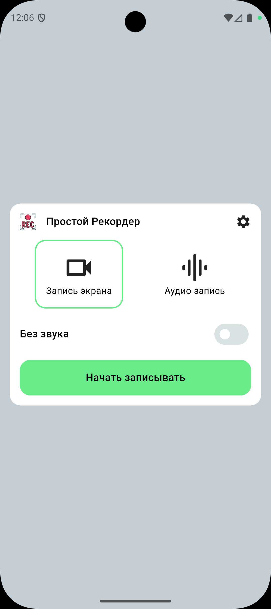
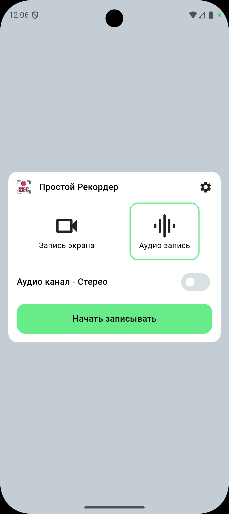
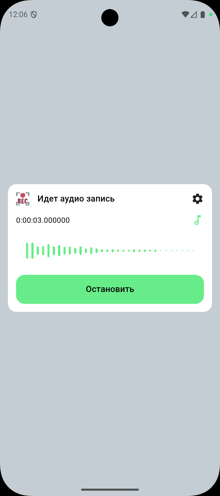
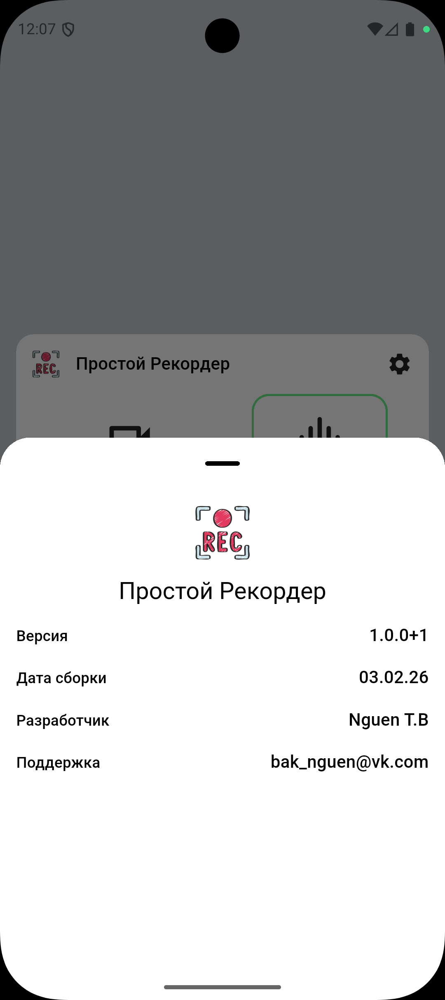

## Recorder App

Небольшое Flutter-приложение для записи аудио и экрана с визуализацией FFT (спектра).

| | | ||
|---|---|---|---|
| ||||

**Ключевые возможности**

- Запись микрофона (WAV)
- Запись экрана (с опцией захвата аудио)
- Визуализация аудиосигнала (Bar visualizer)

**Технологии**: Flutter, `fft_recorder_ui`, `flutter_recorder`, `flutter_screen_recording`.

## Требования

- Flutter SDK (рекомендовано последняя стабильная версия)
- Android SDK (для сборки Android-приложений)
- На macOS: Xcode для iOS-сборок

Особенности платформы Android:

- Android NDK необходим для некоторых нативных библиотек. Если при сборке появится ошибка о "malformed NDK" или отсутствующем `source.properties`, удалите проблемную папку NDK и позвольте Gradle её перекачать (см. раздел "Устранение неполадок").

## Быстрый старт (локальная разработка)

1. Установите зависимости:

```bash
flutter pub get
```

2. Запустите приложение на устройстве или эмуляторе:

## Recorder App

A small Flutter application for recording audio and screen with FFT (spectrum) visualization.

Key features

- Microphone recording (WAV)
- Screen recording (optionally with audio)
- Real-time audio visualization (bar visualizer)

Tech stack: Flutter, `fft_recorder_ui`, `flutter_recorder`, `flutter_screen_recording`.

Requirements

- Flutter SDK (stable channel recommended)
- Android SDK (for Android builds)
- macOS: Xcode (for iOS builds)

Android notes

- Some native dependencies require the Android NDK. If you see a Gradle error about a malformed NDK or a missing `source.properties` file, remove the broken NDK folder and let Gradle re-download it (see Troubleshooting).

Quick start (development)

1. Install dependencies:

```bash
flutter pub get
```

2. Run on a device or emulator:

```bash
flutter run
```

3. Build an Android APK (release):

```bash
flutter build apk --release
```

Usage

- Choose between audio recording and screen recording in the app.
- The app will request microphone permission for audio recording.
- When recording starts a duration timer appears; stopping saves the file to `Downloads` (or the configured folder).

Development notes

- App source is under `lib/`.
- Recorder BLoC: `lib/feature/recorder/bloc/recorder_bloc.dart`.
- Audio visualization widget: `lib/shared/audio_wave.dart`.

Troubleshooting

- Gradle error: "NDK ... did not have a source.properties file"
  - This usually means the NDK download was corrupted. Remove the local NDK folder and rebuild:

```bash
rm -rf "$HOME/Library/Android/sdk/ndk/27.0.12077973"
flutter clean
flutter pub get
flutter run
```

- To install a known stable NDK version manually:

```bash
sdkmanager --install "ndk;21.4.7075529"
```

Visualization tips

- The FFT visualizer should listen to the controller's `ValueListenable` (use `ValueListenableBuilder`) to update when new FFT data arrives.
- Make sure `barWidth`, `barCount`, and spacing are computed so bars fit the available width.

Contributing

- Open issues with reproduction steps.
- Make small focused pull requests.

License
This repository doesn't include a license file. Add a `LICENSE` if you want to specify usage terms.
